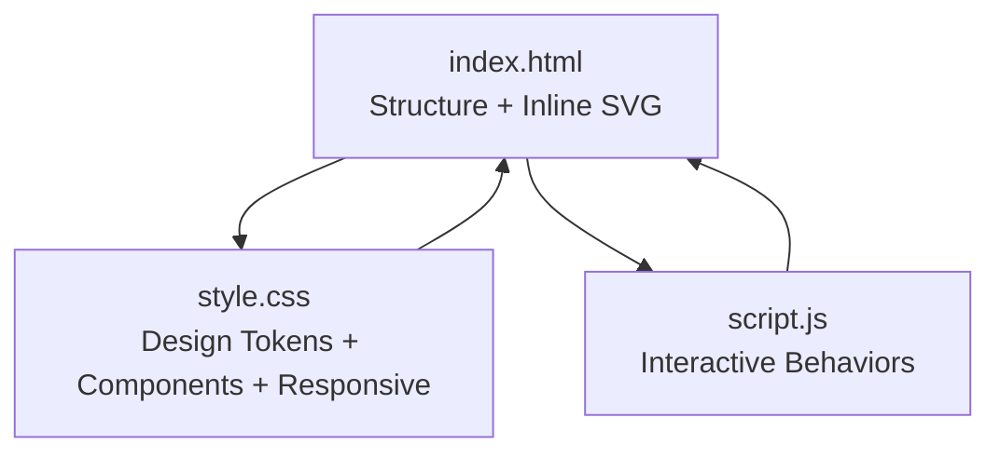
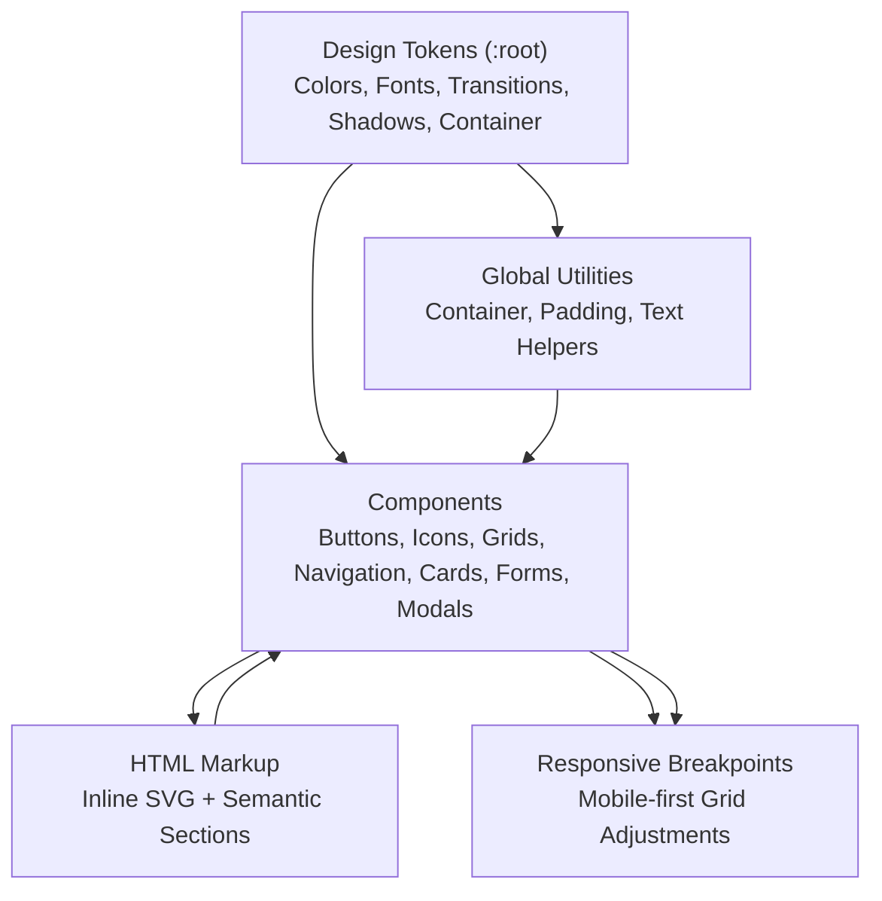

# Design System & Styling

<cite>
**Referenced Files in This Document**
- [style.css](file://style.css)
- [index.html](file://index.html)
- [script.js](file://script.js)
</cite>

## Table of Contents
1. [Introduction](#introduction)
2. [Project Structure](#project-structure)
3. [Core Components](#core-components)
4. [Architecture Overview](#architecture-overview)
5. [Detailed Component Analysis](#detailed-component-analysis)
6. [Dependency Analysis](#dependency-analysis)
7. [Performance Considerations](#performance-considerations)
8. [Troubleshooting Guide](#troubleshooting-guide)
9. [Conclusion](#conclusion)
10. [Appendices](#appendices)

## Introduction
This document describes the design system and styling architecture for the Red Hawk Investment website. It documents the CSS custom properties (design tokens), color palette, typography system, spacing and grid patterns, component-based styling, SVG integration, glassmorphism and gradient effects, and responsive design strategy. It also provides guidelines for maintaining consistency, extending the system, and customizing themes.

## Project Structure
The site follows a minimal, single-file architecture:
- HTML defines the page structure and integrates inline SVG graphics.
- CSS provides global styles, design tokens, component classes, and responsive media queries.
- JavaScript adds interactive behaviors (navigation, carousel, counters, tabs, forms, modals).

**Diagram sources**
- [index.html:1-743](file://index.html#L1-L743)
- [style.css:1-1862](file://style.css#L1-L1862)
- [script.js:1-324](file://script.js#L1-L324)

**Section sources**
- [index.html:1-743](file://index.html#L1-L743)
- [style.css:1-1862](file://style.css#L1-L1862)
- [script.js:1-324](file://script.js#L1-L324)

## Core Components
The design system centers around a set of reusable, composable CSS classes and custom properties:

- Design tokens (CSS custom properties): Colors, fonts, transitions, shadows, container width.
- Global utilities: containers, section padding, text transforms, font helpers.
- Components: buttons, icons, section headings, grid layouts, navigation, hero carousel, stats counter, cards, tabs, forms, modals, footer.
- SVG integration: inline vector graphics for branding and icons.
- Glassmorphism and gradients: backdrop filters, translucent panels, and gradient accents.
- Responsive breakpoints: mobile-first grid adjustments and navigation behavior.

Key design token categories:
- Color palette: primary (#d3122a), secondary dark backgrounds, neutral grays, gold accent, white, and alpha variants for borders and glows.
- Typography: headings use Outfit, body copy uses Inter; consistent font weights and sizes.
- Spacing: consistent padding/margins via utility classes and component-specific spacing.
- Effects: transitions, shadows, glows, and gradients.

**Section sources**
- [style.css:5-34](file://style.css#L5-L34)
- [style.css:86-123](file://style.css#L86-L123)
- [style.css:124-177](file://style.css#L124-L177)
- [style.css:178-186](file://style.css#L178-L186)
- [style.css:217-223](file://style.css#L217-L223)
- [style.css:229-391](file://style.css#L229-L391)
- [style.css:397-504](file://style.css#L397-L504)
- [style.css:510-575](file://style.css#L510-L575)
- [style.css:597-710](file://style.css#L597-L710)
- [style.css:715-790](file://style.css#L715-L790)
- [style.css:795-864](file://style.css#L795-L864)
- [style.css:1084-1147](file://style.css#L1084-L1147)
- [style.css:1157-1275](file://style.css#L1157-L1275)
- [style.css:1281-1441](file://style.css#L1281-L1441)
- [style.css:1446-1542](file://style.css#L1446-L1542)
- [style.css:1548-1698](file://style.css#L1548-L1698)
- [style.css:1704-1862](file://style.css#L1704-L1862)

## Architecture Overview
The styling architecture is component-centric and token-driven:
- Centralized design tokens in :root define brand colors, typography, transitions, shadows, and container width.
- Global utilities enable consistent spacing and typography across components.
- Component classes encapsulate visual states (hover, active, focus) and layout patterns (grid, flex).
- SVG is embedded directly in HTML for branding and icons, enabling full control over color and scaling.
- Responsive behavior is handled via media queries targeting key breakpoints.

**Diagram sources**
- [style.css:5-34](file://style.css#L5-L34)
- [style.css:86-123](file://style.css#L86-L123)
- [style.css:124-177](file://style.css#L124-L177)
- [style.css:217-223](file://style.css#L217-L223)
- [style.css:229-391](file://style.css#L229-L391)
- [style.css:397-504](file://style.css#L397-L504)
- [style.css:510-575](file://style.css#L510-L575)
- [style.css:597-710](file://style.css#L597-L710)
- [style.css:715-790](file://style.css#L715-L790)
- [style.css:795-864](file://style.css#L795-L864)
- [style.css:1084-1147](file://style.css#L1084-L1147)
- [style.css:1157-1275](file://style.css#L1157-L1275)
- [style.css:1281-1441](file://style.css#L1281-L1441)
- [style.css:1446-1542](file://style.css#L1446-L1542)
- [style.css:1548-1698](file://style.css#L1548-L1698)
- [style.css:1704-1862](file://style.css#L1704-L1862)

## Detailed Component Analysis

### Design Tokens and Typography
- Tokens include primary, secondary, background, text, accent gold, border colors, and glow effects.
- Typography uses Inter for body and Outfit for headings, with consistent weights and letter-spacing.
- Container width is centralized for consistent content width across sections.

Best practices:
- Prefer tokens over hardcoded values for colors and spacing.
- Use font-family tokens to maintain consistency across components.

**Section sources**
- [style.css:5-34](file://style.css#L5-L34)
- [style.css:57-68](file://style.css#L57-L68)
- [style.css:86-92](file://style.css#L86-L92)

### Buttons and Icons
- Button classes define shared styles (flex alignment, padding, radius, transitions).
- Primary and secondary variants differ in border/background/text color.
- Hover states include subtle elevation and glow.
- Icon class applies consistent sizing and color to inline SVG icons.

Guidelines:
- Use .btn-primary for primary actions, .btn-secondary for secondary actions.
- Combine .btn with .btn-block for full-width actions.
- Use .icon inside buttons for consistent inline iconography.

**Section sources**
- [style.css:124-177](file://style.css#L124-L177)
- [style.css:178-186](file://style.css#L178-L186)

### Navigation and Header
- Sticky header with backdrop blur and border.
- Scroll progress bar uses a gradient background.
- Logo uses inline SVG with gradients and text elements.
- Navigation links include animated underlines and active states.
- Mobile hamburger menu toggles a drawer with animated bars.

Responsive behavior:
- On small screens, navigation becomes a fixed drawer with slide-in animation.

**Section sources**
- [style.css:229-391](file://style.css#L229-L391)
- [index.html:64-110](file://index.html#L64-L110)
- [script.js:33-57](file://script.js#L33-L57)

### Hero Carousel
- Full-viewport hero with background gradients and image overlays.
- Slides fade in/out with timing functions; content animates in after delay.
- Dot indicators allow manual navigation; autoplay restarts on interaction.

JavaScript integration:
- Auto-play interval cycles slides; resets interval on user interaction.

**Section sources**
- [style.css:397-504](file://style.css#L397-L504)
- [script.js:63-106](file://script.js#L63-L106)

### Stats Counter
- Grid of statistics cards with vertical dividers.
- Animated counters use IntersectionObserver to trigger easing animations when in viewport.

**Section sources**
- [style.css:510-575](file://style.css#L510-L575)
- [script.js:109-153](file://script.js#L109-L153)

### Cards and Value Cards
- Philosophy cards combine icon containers with content areas and hover elevation.
- Value cards include a top accent bar and subtle number overlay on hover.
- Project cards include image overlays, client metadata, and hover zoom.

**Section sources**
- [style.css:597-710](file://style.css#L597-L710)
- [style.css:715-790](file://style.css#L715-L790)
- [style.css:1157-1275](file://style.css#L1157-L1275)

### Tabs and Content Panels
- Tab buttons with animated active indicator.
- Content panels fade in on activation.
- Service visuals include floating images with borders and shadows.

**Section sources**
- [style.css:795-864](file://style.css#L795-L864)
- [script.js:156-179](file://script.js#L156-L179)

### Forms and Modal
- Floating label form design with bottom borders and focus states.
- Validation visually marks invalid inputs with error messages.
- Success modal uses backdrop blur and glass-like panel with animated scale.

**Section sources**
- [style.css:1281-1441](file://style.css#L1281-L1441)
- [style.css:1446-1542](file://style.css#L1446-L1542)
- [script.js:182-271](file://script.js#L182-L271)

### Footer and Newsletter
- Multi-column footer grid with links, contacts, and newsletter subscription.
- Newsletter input with styled submit button and focus states.

**Section sources**
- [style.css:1548-1698](file://style.css#L1548-L1698)
- [style.css:1639-1684](file://style.css#L1639-L1684)

### SVG Graphics Integration
- Inline SVG logo with gradients and vector shapes.
- Inline SVG icons used throughout the interface for consistency and scalability.
- Vector graphics are sized via CSS classes and colored via tokens.

**Section sources**
- [index.html:64-110](file://index.html#L64-L110)
- [style.css:178-186](file://style.css#L178-L186)

### Glassmorphism and Gradient Effects
- Backdrop blur on header and modal overlays for frosted glass effect.
- Gradient accents: scroll progress bar, button hover glow, project meta badges.
- Subtle borders and alpha fills create depth without heavy shadows.

**Section sources**
- [style.css:271-277](file://style.css#L271-L277)
- [style.css:286-288](file://style.css#L286-L288)
- [style.css:1453-1455](file://style.css#L1453-L1455)
- [style.css:1201-1209](file://style.css#L1201-L1209)

### Grid Systems and Layout Utilities
- Utility grid classes for two-column layouts.
- Section-wide grid systems for stats, values, staff, projects.
- Responsive adjustments via media queries for smaller screens.

**Section sources**
- [style.css:217-223](file://style.css#L217-L223)
- [style.css:518-523](file://style.css#L518-L523)
- [style.css:721-725](file://style.css#L721-L725)
- [style.css:926-931](file://style.css#L926-L931)
- [style.css:1157-1161](file://style.css#L1157-L1161)
- [style.css:1704-1862](file://style.css#L1704-L1862)

## Dependency Analysis
The design system exhibits low coupling and high cohesion:
- Tokens are consumed globally by utilities and components.
- Components depend on utilities and tokens; they rarely depend on each other.
- HTML markup provides semantic structure and embeds SVG for branding.
- JavaScript augments behavior without altering styles directly.

```mermaid
graph TB
Tokens["Tokens (:root)"] --> Utils["Utilities (.container, .section-padding, .font-* )"]
Tokens --> Buttons["Buttons (.btn, .btn-primary, .btn-secondary)"]
Tokens --> Nav["Navigation (.main-header, .nav-menu, .nav-link)"]
Tokens --> Hero["Hero (.hero-section, .hero-slide)"]
Tokens --> Stats["Stats (.stats-section, .stat-card)"]
Tokens --> Cards["Cards (.p-card, .value-card, .project-card)"]
Tokens --> Tabs["Tabs (.tab-buttons, .tab-content)"]
Tokens --> Forms["Forms (.form-group, .inquiry-form)"]
Tokens --> Modal["Modal (.modal-overlay, .success-modal)"]
Tokens --> Footer["Footer (.footer-grid, .newsletter-form)"]
HTML["HTML Markup"] --> Nav
HTML --> Hero
HTML --> Cards
HTML --> Tabs
HTML --> Forms
HTML --> Modal
HTML --> Footer
JS["script.js"] --> Nav
JS --> Hero
JS --> Stats
JS --> Tabs
JS --> Forms
JS --> Modal
```

**Diagram sources**
- [style.css:5-34](file://style.css#L5-L34)
- [style.css:86-123](file://style.css#L86-L123)
- [style.css:124-177](file://style.css#L124-L177)
- [style.css:229-391](file://style.css#L229-L391)
- [style.css:397-504](file://style.css#L397-L504)
- [style.css:510-575](file://style.css#L510-L575)
- [style.css:597-710](file://style.css#L597-L710)
- [style.css:715-790](file://style.css#L715-L790)
- [style.css:795-864](file://style.css#L795-L864)
- [style.css:1281-1441](file://style.css#L1281-L1441)
- [style.css:1446-1542](file://style.css#L1446-L1542)
- [style.css:1548-1698](file://style.css#L1548-L1698)
- [index.html:1-743](file://index.html#L1-L743)
- [script.js:1-324](file://script.js#L1-L324)

**Section sources**
- [style.css:1-1862](file://style.css#L1-L1862)
- [index.html:1-743](file://index.html#L1-L743)
- [script.js:1-324](file://script.js#L1-L324)

## Performance Considerations
- CSS custom properties reduce duplication and improve maintainability.
- Minimal JavaScript reduces render-blocking; animations rely on CSS transitions and transforms.
- SVG is embedded inline to avoid extra network requests and ensure crisp rendering at any size.
- Backdrop filters are used sparingly; consider disabling on devices where they degrade performance.
- Media queries optimize layout for smaller screens to reduce reflows.

[No sources needed since this section provides general guidance]

## Troubleshooting Guide
Common issues and resolutions:
- Navigation drawer not closing: ensure event listeners for clicks outside the drawer and link clicks are attached.
- Hero carousel not advancing: verify autoplay interval and that showSlide/reset functions are invoked on dot clicks.
- Stats counter not animating: confirm IntersectionObserver threshold and that the observer targets the stats section.
- Form validation not clearing: ensure invalid classes are removed on input events and that error messages are shown for invalid states.
- Modal not appearing: check that the overlay is added/removed and that body scroll is controlled.

**Section sources**
- [script.js:33-57](file://script.js#L33-L57)
- [script.js:63-106](file://script.js#L63-L106)
- [script.js:109-153](file://script.js#L109-L153)
- [script.js:182-271](file://script.js#L182-L271)

## Conclusion
The Red Hawk Investment design system is a cohesive, token-driven, component-based architecture that emphasizes consistency, performance, and scalability. By centralizing design tokens, leveraging utility classes, and embedding SVG graphics, the system enables rapid iteration while maintaining brand coherence. The responsive strategy ensures optimal experiences across devices, and the interactive behaviors enhance usability without compromising performance.

[No sources needed since this section summarizes without analyzing specific files]

## Appendices

### Design Token Reference
- Colors: primary, secondary, background base and panels, text main and muted, accent gold, white.
- Borders and glows: border color, border glow.
- Typography: headings and body font families, weights, and sizes.
- Effects: transitions, shadows (premium and glow), container width.

**Section sources**
- [style.css:5-34](file://style.css#L5-L34)

### Component Class Index
- Buttons: .btn, .btn-primary, .btn-secondary, .btn-block, .btn-arrow.
- Icons: .icon.
- Utilities: .container, .section-padding, .uppercase, .font-gold, .font-white, .font-small, .m-top-10.
- Grids: .grid-2col, .stats-grid, .values-grid, .staff-grid, .projects-grid.
- Navigation: .main-header, .header-flex, .logo-link, .logo-container, .logo-svg, .nav-menu, .nav-link, .nav-cta, .nav-toggle, .bar.
- Hero: .hero-section, .hero-slider, .hero-slide, .hero-content, .hero-tagline, .hero-title, .hero-description, .hero-actions, .slider-dots, .dot.
- Stats: .stats-section, .stat-card, .stat-number, .stat-label.
- Cards: .p-card, .p-icon, .p-content, .value-card, .value-number, .project-card.
- Tabs: .tabs-container, .tab-buttons, .tab-btn, .tab-content, .tab-text, .tab-visual, .service-panel-img, .staff-grid, .staff-card.
- Forms: .contact-section, .contact-info-panel, .contact-details, .cd-icon, .cd-text, .contact-form-wrapper, .inquiry-form, .form-group, .select-label, .error-msg.
- Modal: .modal-overlay, .success-modal, .modal-close, .success-icon-ring, .inquiry-reference.
- Footer: .main-footer, .footer-grid, .footer-logo, .footer-links, .footer-contacts, .footer-newsletter, .newsletter-form.

**Section sources**
- [style.css:86-1862](file://style.css#L86-L1862)

### Responsive Breakpoints
- Desktop: default grid layouts.
- Tablet: adjusted grids and navigation behavior.
- Mobile: stacked grids, mobile drawer navigation, reduced typography sizes.

**Section sources**
- [style.css:1704-1862](file://style.css#L1704-L1862)