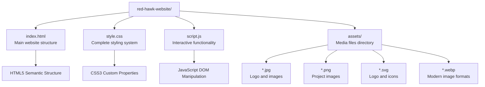
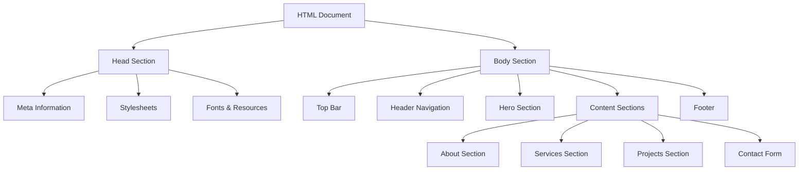
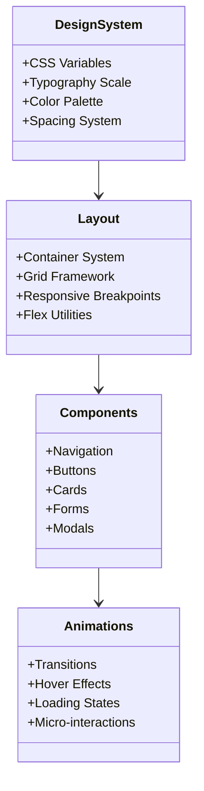
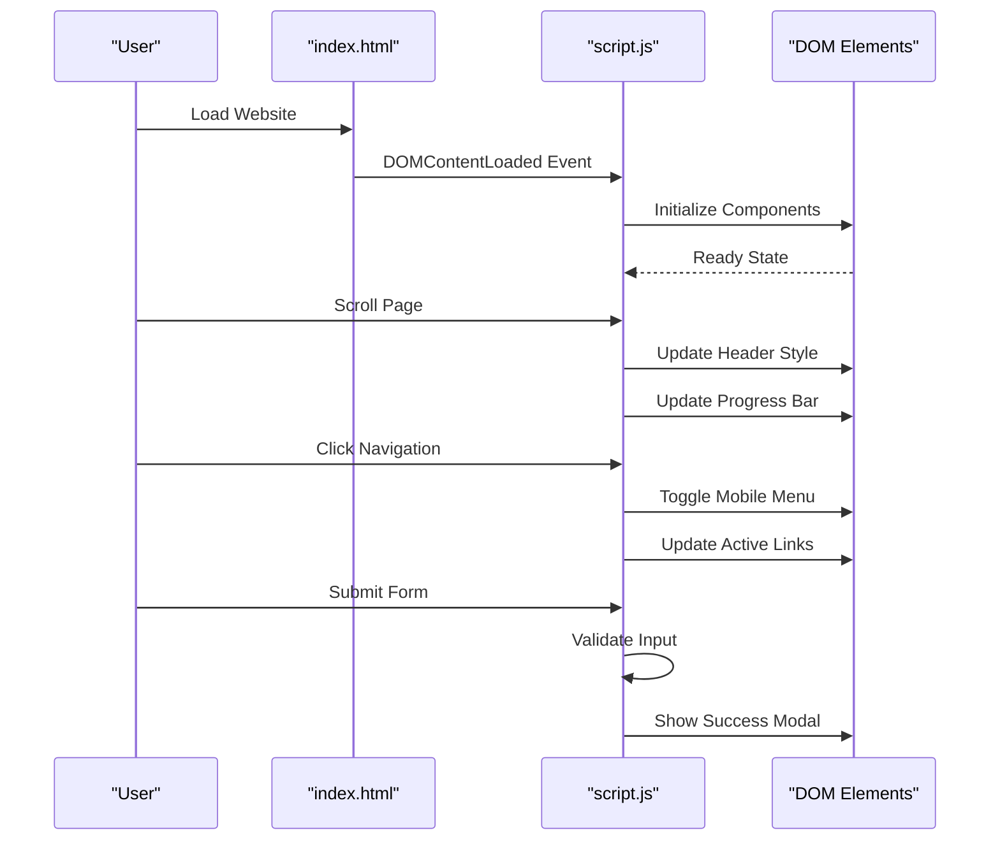
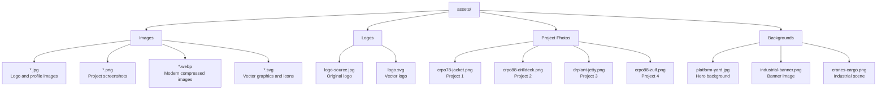

# Getting Started

<cite>
**Referenced Files in This Document**
- [index.html](file://index.html)
- [script.js](file://script.js)
- [style.css](file://style.css)
- [assets](file://assets/)
</cite>

## Table of Contents
1. [Introduction](#introduction)
2. [Prerequisites](#prerequisites)
3. [Setup Instructions](#setup-instructions)
4. [File Structure](#file-structure)
5. [Core Components](#core-components)
6. [Running Locally](#running-locally)
7. [Browser Compatibility](#browser-compatibility)
8. [Assets Organization](#assets-organization)
9. [Verification Checklist](#verification-checklist)
10. [Troubleshooting Guide](#troubleshooting-guide)
11. [Best Practices](#best-practices)

## Introduction

Welcome to the Red Hawk Investment website project. This is a modern, responsive website for a premier Omani engineering and fabrication company specializing in offshore services, structural steel fabrication, and technical staffing solutions. The website showcases the company's expertise in heavy engineering fabrication, safety protocols, and major client partnerships.

The website features a dark theme design with red accents, interactive elements, and professional presentation of services and projects. It's built with pure HTML5, CSS3, and JavaScript without any external frameworks, making it lightweight and easy to maintain.

## Prerequisites

Before you begin working with the Red Hawk Investment website, ensure you have the following knowledge and tools:

### Basic Web Development Knowledge
- Understanding of HTML5 semantic markup and structure
- Familiarity with CSS3 selectors, properties, and modern layout techniques
- Basic JavaScript fundamentals including DOM manipulation and event handling
- Knowledge of responsive design principles and mobile-first approach

### Required Technical Skills
- **HTML5**: Understanding of semantic elements, meta tags, and accessibility attributes
- **CSS3**: Flexbox, Grid, custom properties (CSS variables), animations, and transitions
- **JavaScript**: DOM manipulation, event listeners, form validation, and modern ES6+ features
- **Version Control**: Git basics for repository management
- **Development Tools**: Modern code editor (VS Code recommended) and browser developer tools

### Recommended Development Environment
- **Code Editor**: VS Code with Live Server extension
- **Browser**: Latest Chrome, Firefox, Safari, and Edge for cross-browser testing
- **Node.js**: Optional, for advanced build tools if needed
- **Git**: For version control and collaboration

## Setup Instructions

### Prerequisites Check
Ensure you have the following installed on your development machine:
- Modern web browser (Chrome, Firefox, Safari, Edge)
- Code editor with live reload capabilities
- Basic understanding of command line interface

### Local Development Setup

1. **Download or Clone the Repository**
   ```bash
   git clone https://github.com/your-username/red-hawk-website.git
   cd red-hawk-website
   ```

2. **Verify File Structure**
   The project should contain:
   ```
   red-hawk-website/
   ├── index.html          # Main website structure
   ├── style.css           # Complete styling system
   ├── script.js           # Interactive functionality
   └── assets/             # Media files directory
   ```

3. **Install Development Dependencies**
   ```bash
   # Install Live Server extension for VS Code
   # Or use Python's built-in server
   python -m http.server 8000
   ```

4. **Launch Development Server**
   - **Option A**: Use VS Code Live Server extension
   - **Option B**: Python server: `python -m http.server 8000`
   - **Option C**: Node.js server: `npx serve .`

5. **Access the Website**
   Open your browser and navigate to `http://localhost:8000`

## File Structure

The Red Hawk Investment website follows a clean, minimal file structure designed for simplicity and maintainability:



**Diagram sources**
- [index.html:1-743](file://index.html#L1-L743)
- [style.css:1-1862](file://style.css#L1-L1862)
- [script.js:1-324](file://script.js#L1-L324)

### File Descriptions

#### index.html
The main HTML file contains the complete website structure with:
- **SEO Meta Tags**: Comprehensive metadata for search engines
- **Open Graph Integration**: Social media sharing optimization
- **Responsive Design**: Mobile-first approach with media queries
- **Accessibility Features**: ARIA labels and semantic HTML
- **SVG Graphics**: Custom logo and icon implementations
- **Interactive Elements**: Forms, modals, and navigation systems

#### style.css
The stylesheet implements a comprehensive design system with:
- **CSS Custom Properties**: Centralized design tokens and variables
- **Grid Layout System**: Responsive grid-based layouts
- **Animation Framework**: Smooth transitions and micro-interactions
- **Dark Theme**: Professional dark color scheme with red accents
- **Mobile Responsiveness**: Progressive enhancement across breakpoints
- **Performance Optimized**: Efficient CSS with minimal repaints

#### script.js
The JavaScript file handles all interactive functionality:
- **Sticky Navigation**: Dynamic header behavior on scroll
- **Hero Carousel**: Auto-rotating banner with manual controls
- **Form Validation**: Client-side validation with real-time feedback
- **Modal System**: Non-intrusive success notifications
- **Tab Switching**: Dynamic content panels
- **Statistics Count-up**: Animated number displays

**Section sources**
- [index.html:1-743](file://index.html#L1-L743)
- [style.css:1-1862](file://style.css#L1-L1862)
- [script.js:1-324](file://script.js#L1-L324)

## Core Components

### HTML Structure Analysis

The website uses semantic HTML5 elements organized in a logical hierarchy:



**Diagram sources**
- [index.html:32-130](file://index.html#L32-L130)
- [index.html:133-179](file://index.html#L133-L179)
- [index.html:205-254](file://index.html#L205-L254)

### CSS Architecture

The stylesheet follows a modular approach with clear separation of concerns:



**Diagram sources**
- [style.css:5-34](file://style.css#L5-L34)
- [style.css:87-96](file://style.css#L87-L96)
- [style.css:125-177](file://style.css#L125-L177)

### JavaScript Functionality

The JavaScript implements a feature-rich interactive experience:



**Diagram sources**
- [script.js:6-27](file://script.js#L6-L27)
- [script.js:37-57](file://script.js#L37-L57)
- [script.js:213-247](file://script.js#L213-L247)

**Section sources**
- [index.html:1-743](file://index.html#L1-L743)
- [style.css:1-1862](file://style.css#L1-L1862)
- [script.js:1-324](file://script.js#L1-L324)

## Running Locally

### Method 1: Using Live Server Extension (Recommended)

1. **Install VS Code Live Server Extension**
   - Open VS Code
   - Go to Extensions (`Ctrl/Cmd + Shift + X`)
   - Search for "Live Server" by Ritwick Dey
   - Install and reload VS Code

2. **Open Project in VS Code**
   - Open folder containing the website files
   - Right-click on `index.html`
   - Select "Open with Live Server"

3. **Access the Website**
   - Browser automatically opens at `http://localhost:5500`
   - Changes are automatically reloaded

### Method 2: Using Python Built-in Server

1. **Navigate to Project Directory**
   ```bash
   cd red-hawk-website
   ```

2. **Start Server**
   ```bash
   # Python 3.x
   python -m http.server 8000
   
   # Python 2.x (legacy)
   python -m SimpleHTTPServer 8000
   ```

3. **Access the Website**
   - Open browser to `http://localhost:8000`

### Method 3: Using Node.js Serve

1. **Install Serve Globally**
   ```bash
   npm install -g serve
   ```

2. **Start Server**
   ```bash
   serve -p 8000
   ```

3. **Access the Website**
   - Open browser to `http://localhost:8000`

### Method 4: Using Browser Developer Tools

1. **Open Browser DevTools**
   - Right-click anywhere on the page
   - Select "Inspect" or press `Ctrl/Cmd + Shift + I`

2. **Enable Local File Access**
   - Navigate to "Sources" tab
   - Enable "Allow Local File Access"

3. **Open File System**
   - Click "File System" tab
   - Add project folder
   - Click on `index.html` to open

## Browser Compatibility

### Supported Browsers

The website is designed to work across modern browsers with excellent compatibility:

| Browser | Version | Status | Notes |
|---------|---------|--------|-------|
| Chrome | Latest | ✅ Fully Compatible | Best Experience |
| Firefox | Latest | ✅ Fully Compatible | Excellent Support |
| Safari | Latest | ✅ Fully Compatible | Good Experience |
| Edge | Latest | ✅ Fully Compatible | Modern Standards |
| Internet Explorer | 11 | ⚠️ Partial | Limited CSS3 support |

### Browser-Specific Features

#### Modern Browsers (Chrome, Firefox, Safari, Edge)
- **CSS Custom Properties**: Full support for design tokens
- **Flexbox/Grid**: Native implementation
- **CSS Animations**: Smooth transitions and transforms
- **Intersection Observer**: Advanced scroll effects
- **SVG Graphics**: Full vector support

#### Internet Explorer 11
- **Limited CSS3**: Some advanced features may degrade gracefully
- **JavaScript Polyfills**: Basic polyfills included
- **SVG Support**: Basic vector graphics support
- **Responsive Design**: Media queries supported

### Testing Across Browsers

To ensure compatibility, test the website on:

1. **Desktop Testing**
   - Chrome DevTools Device Toolbar
   - Firefox Developer Tools
   - Safari Web Inspector

2. **Mobile Testing**
   - Chrome DevTools Mobile Emulation
   - Safari iOS Simulator
   - Physical device testing

3. **Cross-Browser Validation**
   - BrowserStack for automated testing
   - Sauce Labs for continuous integration

## Assets Organization

The assets directory contains all media files used throughout the website:



**Diagram sources**
- [assets/](file://assets/)

### Asset Types and Usage

#### Project Images
- **crpo78-jacket.png**: CRPO-78 Jacket fabrication showcase
- **crpo88-drilldeck.png**: Drill deck structure project
- **drplant-jetty.png**: Production DR Plant billet yard
- **crpo88-zulf.png**: ZULF Jacket fabrication

#### Background Images
- **platform-yard.jpg**: Main hero banner background
- **industrial-banner.png**: Secondary banner image
- **cranes-cargo.png**: Industrial operations background

#### Logos and Branding
- **logo-source.jpg**: Original high-resolution logo
- **logo.svg**: Scalable vector logo for crisp rendering

#### Miscellaneous Media
- **media__*.jpg/png/webp**: Various project documentation and promotional materials

### Image Optimization Guidelines

When adding new assets:

1. **Format Selection**
   - Use `.webp` for modern browsers
   - Provide fallback `.jpg` and `.png` formats
   - Use `.svg` for logos and icons

2. **Compression**
   - Compress images to reduce load times
   - Maintain quality while reducing file size
   - Use appropriate resolution for target devices

3. **Naming Convention**
   - Use descriptive lowercase names
   - Include project identifiers
   - Maintain consistent naming patterns

**Section sources**
- [assets/](file://assets/)

## Verification Checklist

### Feature Verification

Complete this checklist to ensure all website features work correctly:

#### Navigation and Menu
- [ ] Desktop navigation links work properly
- [ ] Mobile hamburger menu expands and collapses
- [ ] Active navigation highlighting updates on scroll
- [ ] Smooth scrolling to sections works

#### Hero Carousel
- [ ] Auto-rotation cycles through slides
- [ ] Manual navigation dots work
- [ ] Hover effects on carousel elements
- [ ] Responsive behavior on mobile devices

#### Interactive Elements
- [ ] Form validation provides real-time feedback
- [ ] Success modal appears after form submission
- [ ] Tab switching between fabrication and staffing
- [ ] Statistics counter animation triggers on scroll

#### Visual Effects
- [ ] Scroll progress bar updates correctly
- [ ] Header shrinks on scroll
- [ ] Hover animations on cards and buttons
- [ ] Responsive grid layouts adjust properly

#### Accessibility
- [ ] Proper ARIA labels on interactive elements
- [ ] Keyboard navigation support
- [ ] Screen reader compatibility
- [ ] Color contrast meets WCAG guidelines

### Browser Testing Checklist

#### Desktop Browsers
- [ ] Chrome: Latest version
- [ ] Firefox: Latest version
- [ ] Safari: Latest version
- [ ] Edge: Latest version

#### Mobile Devices
- [ ] iPhone Safari: Latest iOS
- [ ] Android Chrome: Latest Android
- [ ] iPad Safari: Latest iPadOS

#### Cross-Browser Issues
- [ ] Check for CSS3 feature support
- [ ] Verify JavaScript compatibility
- [ ] Test touch interactions
- [ ] Validate responsive breakpoints

## Troubleshooting Guide

### Common Setup Issues

#### 1. Website Not Loading Locally

**Problem**: Browser shows "This site can't be reached"
**Solution**:
```bash
# Check if server is running
netstat -an | grep 8000

# Try alternative ports
python -m http.server 8080
npx serve -p 8080
```

#### 2. Assets Not Loading (404 Errors)

**Problem**: Images and resources show broken links
**Solution**:
- Verify asset paths in HTML match actual file locations
- Check file permissions and case sensitivity
- Ensure assets directory is in the correct location

#### 3. CSS Not Applying

**Problem**: Website loads but looks unstyled
**Solution**:
- Check browser console for CSS errors
- Verify stylesheet link in HTML head section
- Ensure file encoding is UTF-8
- Clear browser cache and hard refresh

#### 4. JavaScript Not Working

**Problem**: Interactive elements don't respond
**Solution**:
- Check browser console for JavaScript errors
- Verify script tag placement in HTML
- Ensure no conflicting JavaScript libraries
- Test with browser's developer tools

### Browser-Specific Issues

#### Internet Explorer Problems
**Issue**: Modern CSS features not displaying correctly
**Solutions**:
- Add CSS prefixes for older browsers
- Provide graceful degradation for unsupported features
- Test with IE Developer Tools

#### Safari Mobile Issues
**Issue**: Touch interactions not working properly
**Solution**:
- Add touch event listeners
- Ensure proper viewport meta tag
- Test with Safari iOS Simulator

### Performance Issues

#### Slow Loading Times
**Solutions**:
- Optimize image sizes and formats
- Minimize CSS and JavaScript files
- Enable browser caching
- Use lazy loading for images

#### Animation Performance
**Solutions**:
- Use transform and opacity for animations
- Avoid layout thrashing
- Test on lower-end devices
- Consider reduced motion preferences

### Debugging Tools

#### Browser Developer Tools
- **Elements Tab**: Inspect HTML structure and CSS application
- **Console Tab**: View JavaScript errors and warnings
- **Network Tab**: Monitor asset loading and performance
- **Performance Tab**: Analyze page load and runtime performance

#### Common Console Errors
- **SyntaxError**: Check JavaScript syntax and file encoding
- **ReferenceError**: Verify script loading order
- **TypeError**: Check for undefined variables or methods
- **NetworkError**: Verify file paths and server configuration

### Security Considerations

#### Mixed Content Issues
**Problem**: Secure site loading insecure resources
**Solution**:
- Ensure all assets use HTTPS
- Check for mixed protocol references
- Use relative URLs for internal assets

#### XSS Prevention
**Note**: The website is static and doesn't process user input server-side
- Client-side validation is for user experience only
- Never trust user input - implement server-side validation if extending functionality

## Best Practices

### Development Workflow

#### Code Organization
- **Keep files modular**: Separate concerns into distinct files
- **Use meaningful names**: Descriptive file and class names
- **Maintain consistency**: Follow established naming conventions
- **Comment important sections**: Explain complex logic and design decisions

#### Performance Optimization
- **Minimize HTTP requests**: Combine CSS and JavaScript files
- **Optimize images**: Use appropriate formats and compression
- **Lazy load non-critical resources**: Defer loading of secondary content
- **Use efficient selectors**: Avoid overly complex CSS selectors

#### Accessibility Standards
- **Semantic HTML**: Use appropriate HTML5 semantic elements
- **ARIA labels**: Provide meaningful labels for interactive elements
- **Keyboard navigation**: Ensure full keyboard accessibility
- **Color contrast**: Maintain sufficient contrast ratios for readability

#### Cross-Browser Compatibility
- **Test regularly**: Verify functionality across target browsers
- **Graceful degradation**: Provide fallbacks for unsupported features
- **Progressive enhancement**: Add advanced features for modern browsers
- **Polyfill selectively**: Include only necessary polyfills

### Maintenance Guidelines

#### Regular Updates
- **Monitor browser support**: Stay informed about feature availability
- **Update dependencies**: Keep development tools current
- **Security patches**: Apply security updates promptly
- **Performance monitoring**: Track and optimize loading performance

#### Documentation Standards
- **Inline comments**: Explain complex logic and algorithms
- **External documentation**: Maintain separate documentation for complex features
- **Change logs**: Track modifications and their rationale
- **Code reviews**: Implement peer review process for significant changes

#### Backup and Version Control
- **Regular commits**: Commit frequently with meaningful messages
- **Branch management**: Use feature branches for experimental changes
- **Tag releases**: Tag stable versions for production deployments
- **Backup strategy**: Maintain multiple backup copies of important files

By following these guidelines and best practices, you'll be able to effectively develop, maintain, and extend the Red Hawk Investment website while ensuring optimal performance and user experience across all supported platforms.