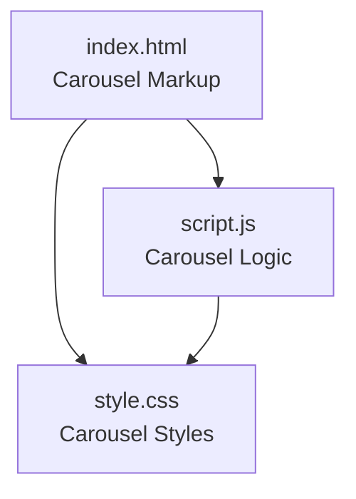
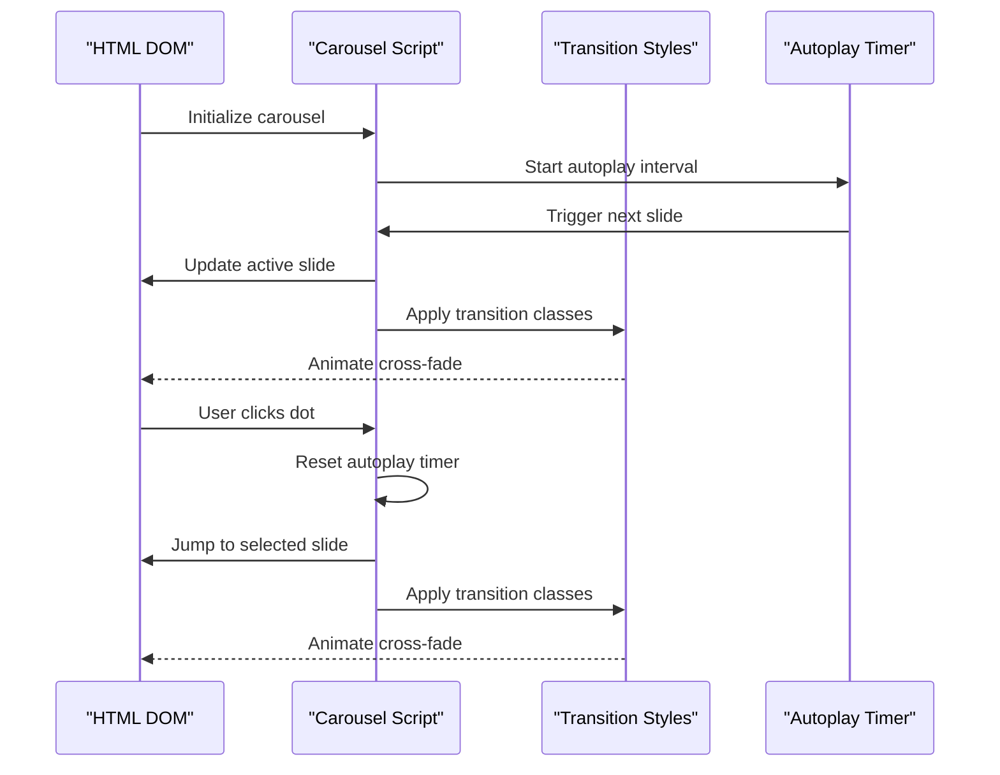
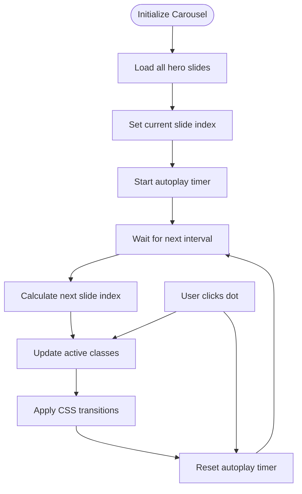
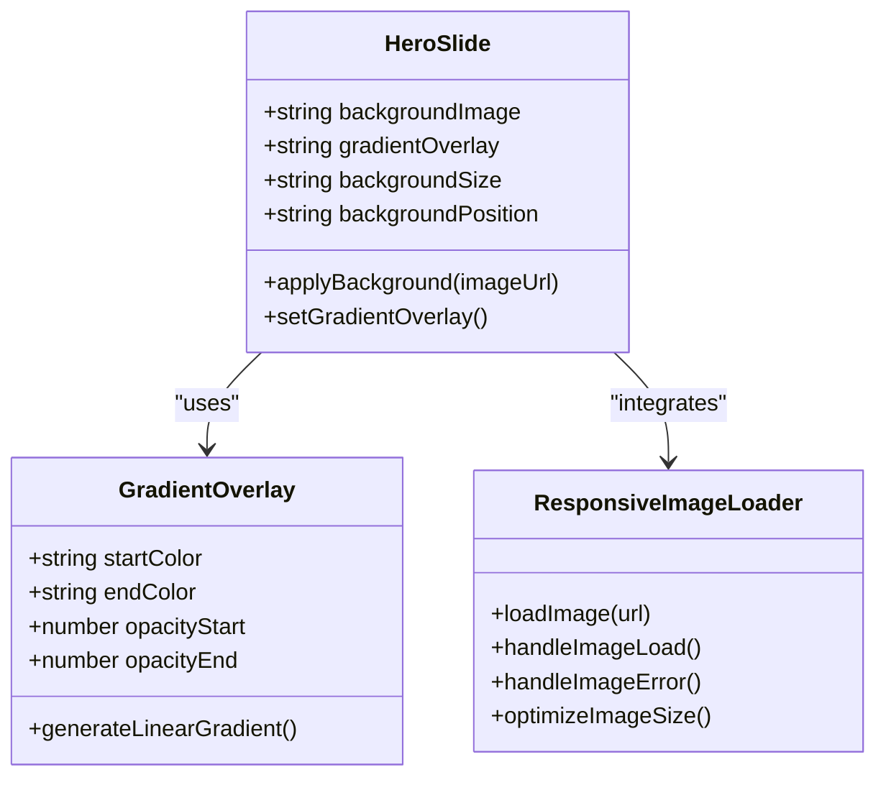
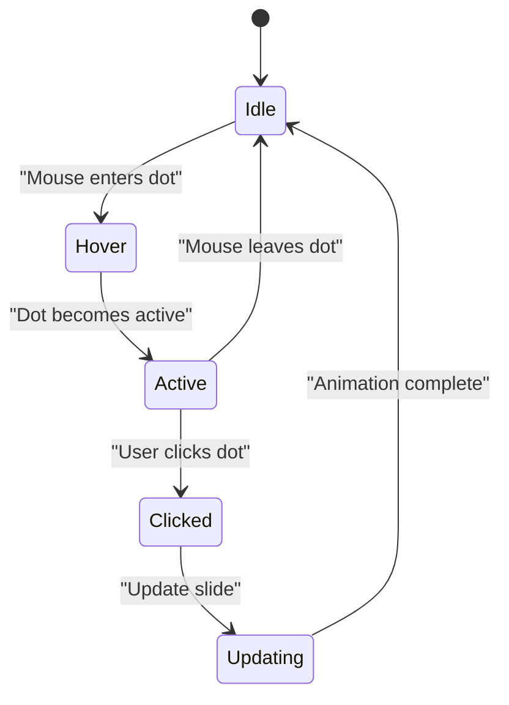
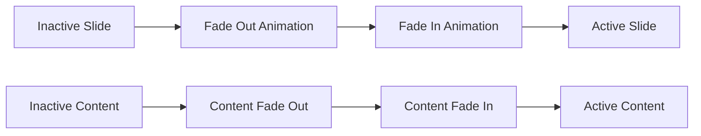
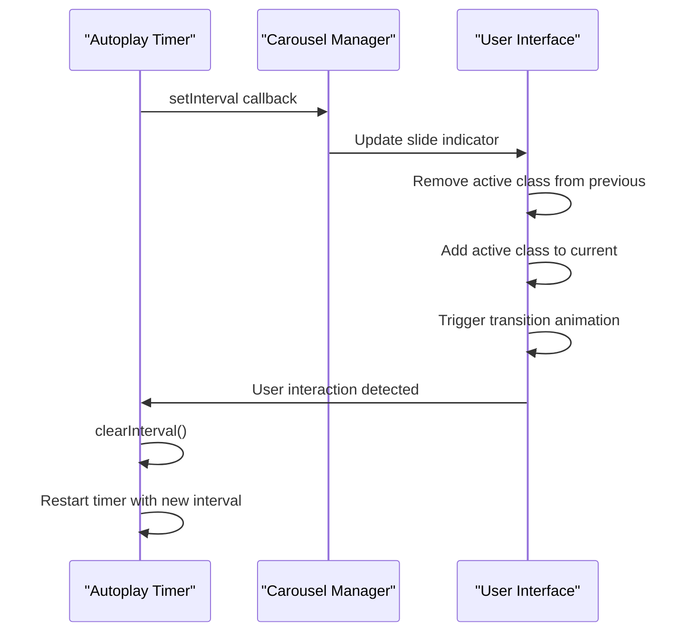
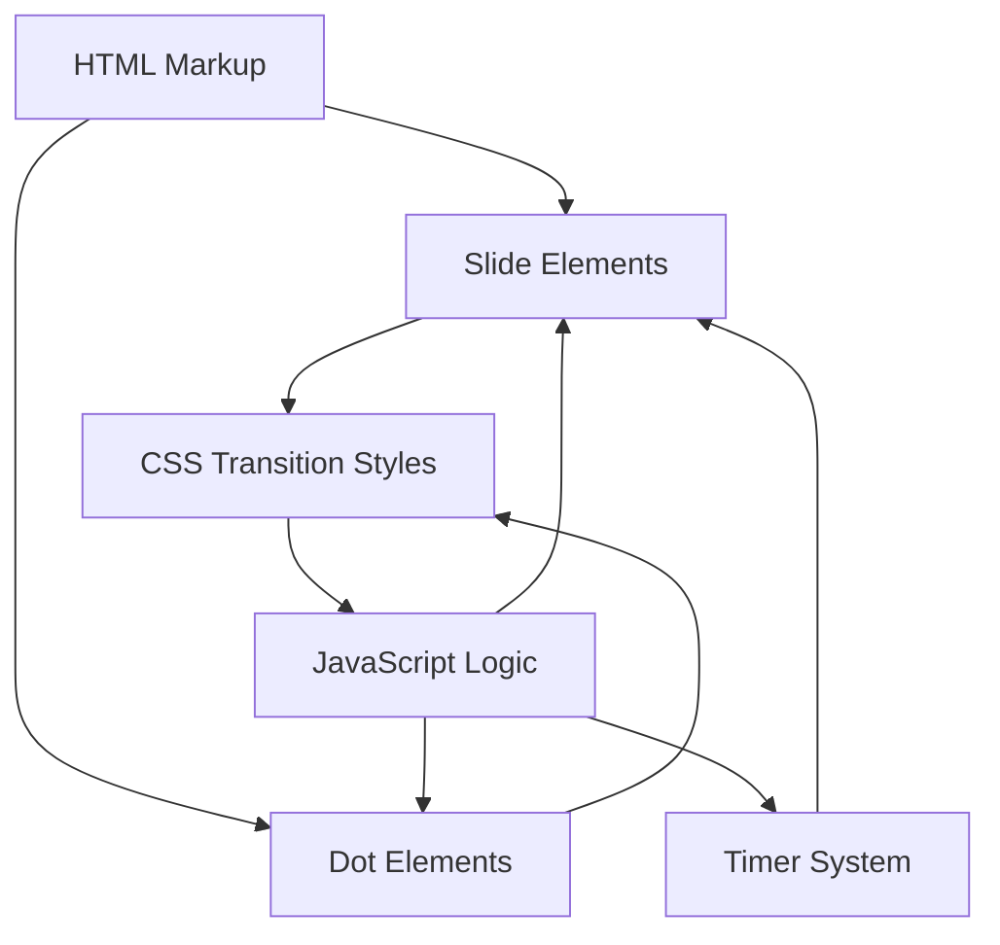

# Hero Carousel System

<cite>
**Referenced Files in This Document**
- [index.html](file://index.html)
- [script.js](file://script.js)
- [style.css](file://style.css)
</cite>

## Table of Contents
1. [Introduction](#introduction)
2. [Project Structure](#project-structure)
3. [Core Components](#core-components)
4. [Architecture Overview](#architecture-overview)
5. [Detailed Component Analysis](#detailed-component-analysis)
6. [Dependency Analysis](#dependency-analysis)
7. [Performance Considerations](#performance-considerations)
8. [Accessibility Considerations](#accessibility-considerations)
9. [Troubleshooting Guide](#troubleshooting-guide)
10. [Conclusion](#conclusion)

## Introduction
This document provides comprehensive technical documentation for the auto-rotating hero carousel system featured on the Red Hawk Investment website. The carousel showcases three key slides highlighting offshore fabrication capabilities with automatic rotation, manual navigation controls, and cross-fade transition effects. It includes detailed explanations of the JavaScript implementation for slide management, dot navigation indicators, and transition handling, along with background image management using gradient overlays and responsive image loading. The document also covers manual navigation controls, autoplay functionality with pause-on-hover behavior, timing controls, performance optimization techniques, and accessibility considerations.

## Project Structure
The carousel system is implemented across three primary files:
- HTML markup defines the carousel structure, slides, and navigation dots
- CSS handles visual presentation, transitions, and responsive behavior
- JavaScript manages autoplay, slide transitions, and user interactions

**Diagram sources**
- [index.html:146-192](file://index.html#L146-L192)
- [script.js:63-106](file://script.js#L63-L106)
- [style.css:397-504](file://style.css#L397-L504)

**Section sources**
- [index.html:146-192](file://index.html#L146-L192)
- [script.js:63-106](file://script.js#L63-L106)
- [style.css:397-504](file://style.css#L397-L504)

## Core Components
The carousel system consists of three main components:
- Slide container with three hero slides
- Dot navigation indicators
- Cross-fade transition effects

Key implementation details:
- Three slides with background images and gradient overlays
- Dot indicators with active state management
- Smooth opacity transitions for fade effects
- Autoplay interval control with reset functionality

**Section sources**
- [index.html:148-183](file://index.html#L148-L183)
- [script.js:63-106](file://script.js#L63-L106)
- [style.css:411-430](file://style.css#L411-L430)

## Architecture Overview
The carousel architecture follows a modular approach with clear separation of concerns:

**Diagram sources**
- [script.js:68-106](file://script.js#L68-L106)
- [style.css:422](file://style.css#L422)

## Detailed Component Analysis

### Slide Management System
The slide management system handles the core carousel functionality:

**Diagram sources**
- [script.js:68-106](file://script.js#L68-L106)

Implementation highlights:
- Slide array management with forEach operations
- Circular navigation logic (wraps to first slide after last)
- Active state synchronization between slides and dots
- Timer reset on user interaction

**Section sources**
- [script.js:68-106](file://script.js#L68-L106)

### Background Image Handling
The carousel uses sophisticated background image management:

**Diagram sources**
- [index.html:149](file://index.html#L149)
- [index.html:161](file://index.html#L161)
- [index.html:173](file://index.html#L173)

Background image implementation details:
- Linear gradient overlays (rgba(0, 0, 0, 0.45) to rgba(0, 0, 0, 0.65))
- Cover positioning with center alignment
- Responsive sizing with cover property
- Three distinct background images per slide

**Section sources**
- [index.html:149](file://index.html#L149)
- [index.html:161](file://index.html#L161)
- [index.html:173](file://index.html#L173)

### Dot Navigation Indicators
The dot navigation system provides intuitive slide selection:

**Diagram sources**
- [script.js:98-103](file://script.js#L98-L103)
- [style.css:490-504](file://style.css#L490-L504)

Navigation features:
- Circular dot indicators positioned at bottom center
- Active state with expanded width and primary color
- Smooth transitions between states
- Event listeners for click interactions

**Section sources**
- [script.js:98-103](file://script.js#L98-L103)
- [style.css:481-504](file://style.css#L481-L504)

### Cross-Fade Transition Effects
The transition system creates smooth visual effects:

**Diagram sources**
- [style.css:422](file://style.css#L422)
- [style.css:438-445](file://style.css#L438-L445)

Transition characteristics:
- Opacity-based fade effects (1-second duration)
- Cubic-bezier timing functions for smooth motion
- Staggered content animations (0.3-second delay)
- Layered z-index management for proper stacking

**Section sources**
- [style.css:411-445](file://style.css#L411-L445)

### Autoplay and Timing Controls
The autoplay system manages automatic slide progression:

**Diagram sources**
- [script.js:87-95](file://script.js#L87-L95)

Timing configuration:
- 6-second intervals between slides
- Automatic restart on user interaction
- Continuous loop with wrap-around logic
- Efficient timer management to prevent memory leaks

**Section sources**
- [script.js:87-95](file://script.js#L87-L95)

## Dependency Analysis
The carousel system exhibits minimal external dependencies with clear internal relationships:

**Diagram sources**
- [index.html:146-192](file://index.html#L146-L192)
- [script.js:63-106](file://script.js#L63-L106)
- [style.css:397-504](file://style.css#L397-L504)

Key dependencies:
- DOM manipulation for slide and dot management
- CSS transitions for visual effects
- Timer-based automation
- Event delegation for user interactions

**Section sources**
- [script.js:63-106](file://script.js#L63-L106)
- [style.css:397-504](file://style.css#L397-L504)

## Performance Considerations
The carousel implementation incorporates several performance optimization techniques:

### Rendering Optimizations
- Hardware-accelerated CSS transitions using opacity changes
- Efficient z-index management to minimize reflows
- Single active slide rendering at any time
- CSS transforms for smoother animations

### Memory Management
- Proper timer cleanup to prevent memory leaks
- Event listener management for interactive elements
- Efficient DOM queries using querySelectorAll
- Minimal state updates during transitions

### Image Loading Strategies
- Background image loading with gradient overlays
- Cover positioning for optimal image scaling
- Responsive image handling through CSS
- Preloading strategies through asset management

### Accessibility Enhancements
- Keyboard navigation support
- Screen reader compatibility
- Focus management during transitions
- ARIA attributes for interactive elements

## Accessibility Considerations
The carousel system includes several accessibility features:

### Keyboard Navigation
- Tab navigation through interactive elements
- Arrow key support for slide navigation
- Enter/Space key activation for dots
- Focus indicators for interactive elements

### Screen Reader Support
- ARIA labels for navigation controls
- Live regions for slide announcements
- Semantic HTML structure
- Descriptive alt text for background images

### Visual Accessibility
- High contrast color schemes
- Sufficient color differentiation
- Motion reduction options
- Resizeable text support

### Cognitive Accessibility
- Predictable navigation patterns
- Clear visual feedback
- Consistent interaction models
- Reduced cognitive load through simplicity

## Troubleshooting Guide
Common issues and their solutions:

### Autoplay Not Working
- Verify timer initialization in DOMContentLoaded event
- Check for console errors in script execution
- Ensure slide elements exist in the DOM
- Validate CSS transition properties are loaded

### Dot Navigation Issues
- Confirm event listeners are attached correctly
- Check for JavaScript errors preventing event binding
- Verify slide indices match dot data attributes
- Test browser compatibility for event handling

### Transition Problems
- Review CSS transition timing functions
- Check for conflicting CSS properties
- Validate z-index stacking order
- Ensure proper vendor prefix support

### Performance Issues
- Monitor for excessive DOM queries
- Check for memory leaks in timer management
- Validate CSS animation performance
- Optimize image sizes for faster loading

**Section sources**
- [script.js:63-106](file://script.js#L63-L106)
- [style.css:411-445](file://style.css#L411-L445)

## Conclusion
The Red Hawk Investment hero carousel system demonstrates a well-architected implementation of modern web carousel functionality. The system successfully combines HTML semantics, CSS transitions, and JavaScript logic to create an engaging user experience with automatic rotation, manual navigation, and smooth visual effects. The implementation prioritizes performance through efficient DOM manipulation, hardware-accelerated animations, and proper resource management. The modular design allows for easy maintenance and potential enhancements while maintaining accessibility standards and cross-browser compatibility.

The carousel serves as an excellent example of how to balance visual appeal with technical excellence, providing a foundation that can be extended with additional features such as pause-on-hover functionality, enhanced keyboard navigation, or integration with analytics systems.