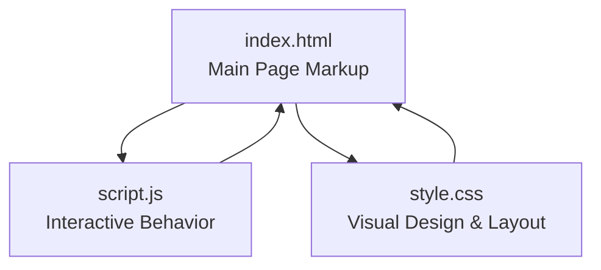
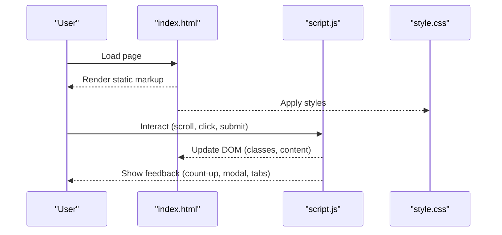
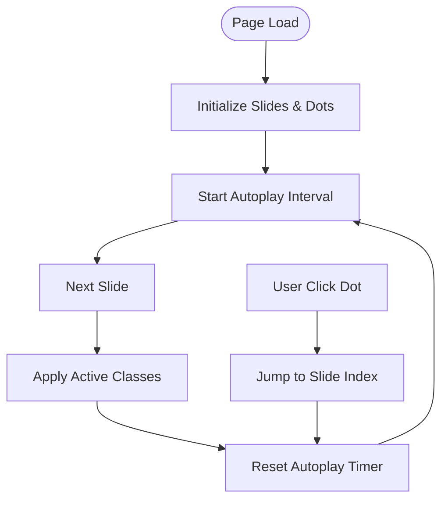
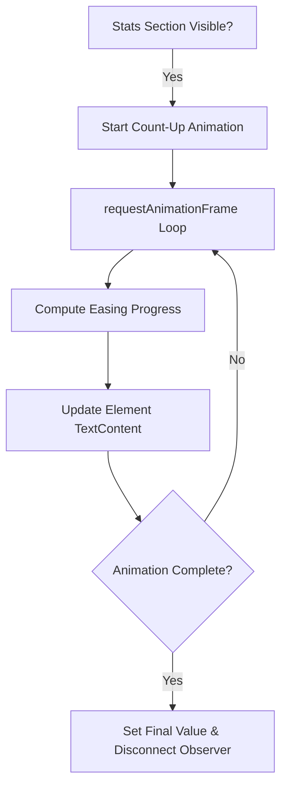
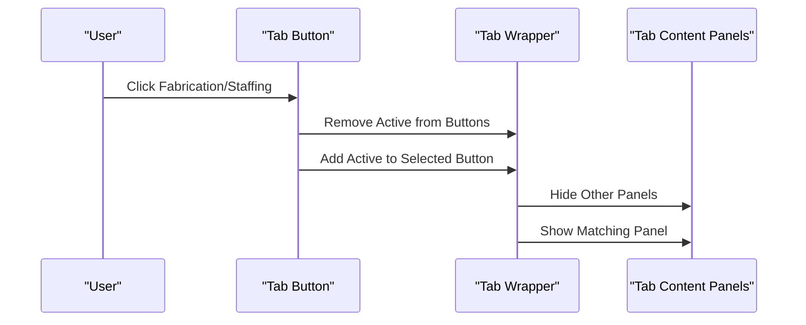
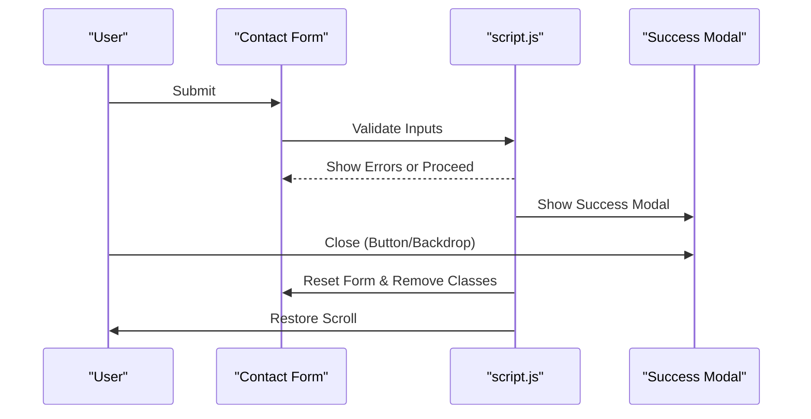
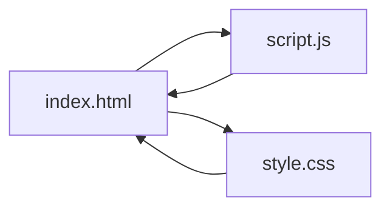

# Project Overview

<cite>
**Referenced Files in This Document**
- [index.html](file://index.html)
- [script.js](file://script.js)
- [style.css](file://style.css)
</cite>

## Table of Contents
1. [Introduction](#introduction)
2. [Project Structure](#project-structure)
3. [Core Components](#core-components)
4. [Architecture Overview](#architecture-overview)
5. [Detailed Component Analysis](#detailed-component-analysis)
6. [Dependency Analysis](#dependency-analysis)
7. [Performance Considerations](#performance-considerations)
8. [Troubleshooting Guide](#troubleshooting-guide)
9. [Conclusion](#conclusion)

## Introduction
This document provides a comprehensive overview of the Red Hawk Investment corporate website project. Red Hawk Investment is a premier Omani engineering and fabrication company headquartered in Sohar, specializing in offshore jackets, platform fabrication, heavy structural erection, and certified technical staffing solutions. The website serves as a digital showcase of the company’s capabilities, safety-first culture, and track record in the Middle Eastern energy and marine industries. It targets potential clients, project leads, and industry partners seeking engineering excellence, safety compliance, and reliable execution.

The site is implemented as a pure frontend application using modern HTML5, CSS3, and vanilla JavaScript. It emphasizes a dark-themed, premium aesthetic aligned with engineering and maritime industries, while delivering responsive navigation, interactive carousels, animated statistics, tabbed content, and a functional contact form with validation and success feedback.

## Project Structure
The project follows a minimal, static-file-first architecture:
- index.html: Single-page application markup with semantic sections for hero banner, about, values, services, HSE policy, clients, projects, and contact.
- script.js: Client-side logic for sticky header, scroll progress, mobile navigation, hero carousel, animated counters, tab switching, form validation, modal overlays, and newsletter handling.
- style.css: Centralized stylesheet defining design tokens, typography, layout grids, component styles, and responsive behavior.

**Diagram sources**
- [index.html:1-743](file://index.html#L1-L743)
- [script.js:1-324](file://script.js#L1-L324)
- [style.css:1-1862](file://style.css#L1-L1862)

**Section sources**
- [index.html:1-743](file://index.html#L1-L743)
- [script.js:1-324](file://script.js#L1-L324)
- [style.css:1-1862](file://style.css#L1-L1862)

## Core Components
- Hero Banner Carousel: Multi-slide hero with automatic rotation, manual dot navigation, and fade transitions.
- Animated Statistics: Count-up animations triggered when the stats section enters the viewport.
- Services Tabs: Toggle between fabrication/erection and technical staffing content.
- Contact Form: Floating-label form with real-time validation and success modal.
- Newsletter Subscription: Minimal form handler for email subscriptions.
- Sticky Header: Shrinks on scroll and displays a progress indicator.
- Clients Logotype Ticker: Infinite horizontal scrolling client logos.

**Section sources**
- [index.html:133-179](file://index.html#L133-L179)
- [index.html:181-202](file://index.html#L181-L202)
- [index.html:300-386](file://index.html#L300-L386)
- [index.html:580-666](file://index.html#L580-L666)
- [index.html:459-480](file://index.html#L459-L480)
- [index.html:56-130](file://index.html#L56-L130)
- [index.html:459-480](file://index.html#L459-L480)

## Architecture Overview
The website is a pure frontend application with no server-side rendering. All interactivity is handled client-side via JavaScript, and styling is centralized in a single stylesheet. The design system is built around CSS custom properties for theme tokens, typography families, transitions, and shadows. The JavaScript module orchestrates:
- DOMContentLoaded initialization
- Event listeners for scroll, resize, and user interactions
- Carousel autoplay and dot navigation
- Intersection Observer for animated counters
- Tab switching and form validation
- Modal lifecycle and newsletter submission

**Diagram sources**
- [index.html:1-743](file://index.html#L1-L743)
- [script.js:6-324](file://script.js#L6-L324)
- [style.css:1-1862](file://style.css#L1-L1862)

## Detailed Component Analysis

### Hero Banner Carousel
The hero carousel cycles through three slides with gradient overlays and background images. It includes:
- Automatic rotation every six seconds
- Dot indicators to jump to specific slides
- Smooth opacity transitions and delayed content entrance

**Diagram sources**
- [script.js:63-106](file://script.js#L63-L106)
- [index.html:133-179](file://index.html#L133-L179)

**Section sources**
- [script.js:63-106](file://script.js#L63-L106)
- [index.html:133-179](file://index.html#L133-L179)

### Animated Statistics Counter
Animated counters count up to target values when the stats section becomes visible. The implementation:
- Uses Intersection Observer to detect viewport entry
- Animates values with easing over two seconds
- Ensures exact final value and disconnects observer after first run

**Diagram sources**
- [script.js:112-153](file://script.js#L112-L153)
- [index.html:181-202](file://index.html#L181-L202)

**Section sources**
- [script.js:112-153](file://script.js#L112-L153)
- [index.html:181-202](file://index.html#L181-L202)

### Services Tabs
The services section provides a tabbed interface toggling between fabrication/erection and technical staffing. Behavior:
- Active tab button highlights with animated underline
- Matching content panel becomes visible
- Smooth fade-in animation for content transitions

**Diagram sources**
- [script.js:159-179](file://script.js#L159-L179)
- [index.html:300-386](file://index.html#L300-L386)

**Section sources**
- [script.js:159-179](file://script.js#L159-L179)
- [index.html:300-386](file://index.html#L300-L386)

### Contact Form Validation and Success Modal
The contact form validates inputs client-side and displays a success modal with a generated reference ID:
- Real-time error clearing on input
- Validation for name length, email format, and message length
- Success modal with backdrop and close controls
- Form reset and scroll restoration on close

**Diagram sources**
- [script.js:185-272](file://script.js#L185-L272)
- [index.html:615-682](file://index.html#L615-L682)

**Section sources**
- [script.js:185-272](file://script.js#L185-L272)
- [index.html:615-682](file://index.html#L615-L682)

### Newsletter Subscription Handler
A lightweight newsletter subscription handler:
- Prevents submission of empty emails
- Alerts the user upon successful registration
- Resets the form after submission

**Section sources**
- [script.js:311-321](file://script.js#L311-L321)
- [index.html:722-728](file://index.html#L722-L728)

### Sticky Header and Scroll Progress
Behavior:
- Header shrinks on scroll and adds a progress bar at the top
- Progress bar width reflects scroll percentage
- Active navigation link updates based on scroll position

**Section sources**
- [script.js:11-305](file://script.js#L11-L305)
- [index.html:56-130](file://index.html#L56-L130)

## Dependency Analysis
The website has no external dependencies. All functionality is self-contained within:
- index.html: Semantic markup and structure
- script.js: Pure JavaScript logic
- style.css: Centralized styling and design system

**Diagram sources**
- [index.html:1-743](file://index.html#L1-L743)
- [script.js:1-324](file://script.js#L1-L324)
- [style.css:1-1862](file://style.css#L1-L1862)

**Section sources**
- [index.html:1-743](file://index.html#L1-L743)
- [script.js:1-324](file://script.js#L1-L324)
- [style.css:1-1862](file://style.css#L1-L1862)

## Performance Considerations
- Lightweight and fast-loading: No external frameworks or libraries reduce payload and render time.
- Efficient animations: requestAnimationFrame-based counters and CSS transitions minimize layout thrashing.
- Intersection Observer: Used for lazy-triggered animations to avoid unnecessary computations.
- Optimized media: Images are referenced directly; consider compression and modern formats for further gains.
- Minimal DOM manipulation: Event delegation and targeted updates improve responsiveness.

[No sources needed since this section provides general guidance]

## Troubleshooting Guide
Common issues and resolutions:
- Carousel not advancing: Verify autoplay interval and slide/dot selectors are present and correct.
- Count-up not triggering: Ensure the stats section is in viewport and Intersection Observer is supported.
- Form validation not working: Confirm input IDs match selectors and event listeners are attached.
- Modal not closing: Check backdrop click handler and modal close button bindings.
- Mobile navigation not toggling: Validate hamburger toggle classes and click-outside logic.

**Section sources**
- [script.js:63-106](file://script.js#L63-L106)
- [script.js:112-153](file://script.js#L112-L153)
- [script.js:185-272](file://script.js#L185-L272)
- [script.js:311-321](file://script.js#L311-L321)

## Conclusion
The Red Hawk Investment website is a streamlined, high-performance showcase of engineering excellence and safety-first operations. Its pure frontend architecture ensures quick delivery, easy maintenance, and a consistent user experience across devices. The design and interactions reflect the company’s commitment to precision, reliability, and industry leadership in the Middle Eastern energy and marine sectors.

[No sources needed since this section summarizes without analyzing specific files]